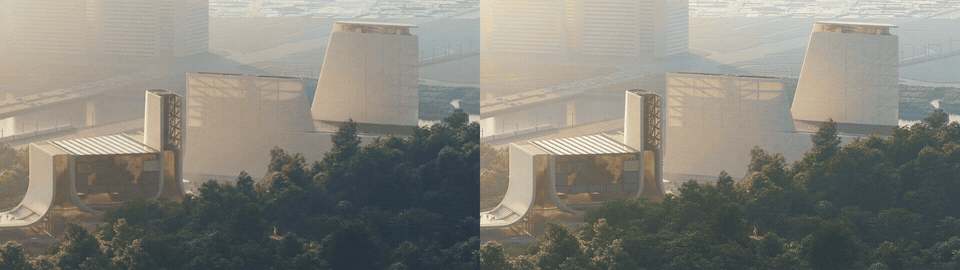

# Runpod ComfyUI worker for LTX 2.5

This project extends [runpod-workers/worker-comfyui](https://github.com/runpod-workers/worker-comfyui) with LTX 2.5 generation and enhancement workflows. It retains the customized Runpod/S3 response integration and adds validated named modes, official-node API graphs, build-time model downloads, dependency locks, startup checks, and failure-safe delivery. The implementation was developed in an isolated working copy to protect the original worker.

The repository contains source code, workflow graphs, model inventories, dependency locks, verification reports, and selected demonstration media in `docs/media`. Model weights download during the Docker build; credentials, local research files, and the local `artifacts` directory are excluded from Git.

## Example result

**Source on the left, CQ Enhancer V2 result on the right.** This clip was enhanced in one continuous job at **2560×1440 / 121 frames**, then presented at **24 FPS / 5.04 seconds**. Worker execution took **11 minutes 28 seconds**. The preview below is reduced to 960 pixels wide and 10 FPS for display; the downloadable result retains its full resolution and 24 FPS.

[](docs/media/cq-2560-single121-before-after.mp4)

[Full-resolution enhanced MP4](docs/media/cq-2560x1440-single121-24fps.mp4) · [Before/after MP4](docs/media/cq-2560-single121-before-after.mp4) · [Still comparison](docs/media/cq-2560-before-after-preview.png)

CQ is generative enhancement: color and fine texture can change. The model ran at 30 FPS internally, with all 121 source and output frames retimed to preserve the final 24 FPS presentation. See the [request example](examples/video_enhance_cq_v2_2560_121.json), [configuration](docs/cq-v2.md), and [measured verification](docs/cq-v2-2560-single121-verification.json).

**Validation status:** the full INT8 Docker image **built and loaded successfully** as `worker-comfyui-ltx25:int8`, with all **eleven model files verified by exact size and SHA256**. All **103 tests passed inside Linux**. That image passed startup, registered **1,003 ComfyUI nodes**, validated its original 18 workflows, ran a real CUDA kernel on the RTX 4090, and measured **52.00 GB** apparent filesystem size. On September 12, the deployed image generated a 1280×768 clip and staged **3840×2160 clips of 9 and 33 frames**, with successful S3 delivery and browser media loading on the user's 48 GB Runpod worker. A separate **direct 4K nine-frame test also succeeded**, sampling once at 3840×2176 and cropping to UHD without video upscaling; execution took **73.208 seconds**. The updated source passes **150 worker tests and 82 tester tests**; the standard catalog has 21 workflows, and the isolated CQ catalog has one source- and live-schema-validated workflow. The new Comfy 4K image layer has not been built; Docker Desktop is now responding again, and the tester executes its bundled 4K graphs through the existing image. Callback/webhook delivery has not been independently tested. See [test results](docs/test-results.md), [staged 4K verification](docs/4k.md), and [direct 4K verification](docs/native-4k.md).

## Official DFR 4K

The separate [DFR worker](docs/dfr-4k.md) runs the publisher's complete staged 4K Python recipe, with compatible BF16 models and CPU offload. It requires a separate image and cannot use the current Comfy INT8 files. The complete `momensirribrick/worker-ltx25-dfr:4k-v1` image is now locally loaded and passed offline verification of all six model hashes and embedded assets. It has not been pushed or tested for DFR generation on Runpod. Packaged image data is approximately 59.69 GB. Build and deployment verification, including recovery from low disk space during unpacking, is recorded separately in [DFR evidence](docs/dfr-verification.json). The earlier direct 4K result had user-reported color artifacts; successful dimensions and delivery did not establish visual quality.

## CQ Enhancer V2

**2560×1440 single-job inference verified:** on September 30, one CQ job generated **121 frames** in **11 minutes 27.902 seconds**, followed by presentation at **24 FPS / 5.041667 seconds**. All source frames were retimed to the recipe's 30 FPS before inference, then all output frames were retimed to 24 FPS. No generation sections or output resizing were used. R2 delivery, full decoding, dimensions, and frame counts passed. Color and texture can change; peak VRAM was not measured. The local compatibility tester enabled both CQ pixel caps at `3686400` and `MAX_CQ_HIGH_RES_FRAMES=121`. These are opt-in limits; the default high-resolution frame cap remains 25. See [single-job evidence](docs/cq-v2-2560-single121-verification.json) and [CQ configuration](docs/cq-v2.md).

**1920-pixel AI inference verified:** five CQ jobs (one 33-frame and four 49-frame sections) regenerated a 200-frame clip at **1920×1088**, then a four-row crop at each edge produced **1920×1080 / 30 FPS / 6.67 seconds**. No spatial output resizing was used. This used the existing image's trusted workflow compatibility path; updated named-mode limits require an image rebuild. See [Full HD evidence](docs/cq-v2-1920-verification.json) and [CQ usage](docs/cq-v2.md).

The separate [`cq-v2` ComfyUI profile](docs/cq-v2.md) implements the publisher's current LTX 2.5 CQ video-enhancement V2 recipe with `ltx2.5-CQ-enhancer-lora-V2.safetensors`. It uses the dev INT8 ConvRot transformer, distilled LoRA 450, CQ V2 LoRA, convolution video VAE, audio VAE, and INT8 Gemma encoder. Six pinned weights total **48,934,613,516 bytes / 45.57 GiB**. The named mode is `video_enhance_cq_v2`; input is fixed to 30 FPS and supports 9–153 frames (`8n+1`), with 1280×704 / 153 frames as the publisher-aligned default and 33 frames as the tester's first qualification preset. Prompt text is optional.

The complete Linux/AMD64 image is published in the private Docker Hub repository as `momensirribrick/worker-comfyui-ltx25-cq:cq-v2`. Its remotely verified digest is `sha256:9bd09e9b9ee2386feb0e09d138be8a761e5faf61512897ea9140c667617b3c8a`, matching the local build. All six weights passed verification. A real Runpod CQ test enhanced a 320×176 base64 clip into **1280×704 / 33 frames / 30 FPS** in **50.481 seconds**, with successful R2 delivery, full video decoding and browser loading. Initial workers exposed only 31.4 GiB and failed the 47 GiB admission policy; the same job completed after the operator corrected GPU settings. The existing job ID, S3 output path and response handling are preserved. Attach Docker Hub read credentials to the Runpod template to pull this private image. Full 153-frame generation, exact publisher-workflow equivalence and peak VRAM still require qualification. See the guide for hardware estimates, API payloads, evidence, and the CQ repository's missing license declaration.

## What is included

**121-frame native 4K follow-up:** the same INT8 worker completed direct 3840×2176 sampling followed by a UHD crop, returning **3840×2160 / 5.041667 seconds at 24 fps**, with successful S3 delivery. Execution took **17 minutes 21.038 seconds**. The tester now accepts **9 or 121 frames** for this native preset, retaining nine as the default. [Measured native 4K results and request example](docs/native-4k.md)

- Image-to-video, video-to-video, first/last frames, text-to-video, audio-guided video, text-to-audio, reference images, motion tracks, control video, inpainting, and outpainting.
- **`video_upscale_x2` with the official LTX 2.5 Pixel Spatial Upscaler IC-LoRA**, including its weights in the default Docker build. Source width/height are doubled; actual input audio is retained through normalization, and silent clips are supported.
- Single- and two-stage variants where provided by the verified workflow sources. The authoritative list is [the workflow manifest](workflows/manifest.json); node graphs and provenance are in [workflows](workflows/PROVENANCE.md).
- The default **INT8 profile** bundles eleven immutable weight records totaling **44.54 GB / 41.48 GiB**, including the official INT8 transformer and Gemma 4 encoder with embedded tokenizer, video/audio VAEs and vocoder, spatial upsampler, and six required IC-LoRAs. The optional BF16 profile totals **75.95 GB / 70.73 GiB**. Both expose the same 21-mode standard catalog, including the dedicated upscaler and three 4K presets. [Complete inventory](docs/model-inventory.md)
- ComfyUI v0.35.0 at a pinned commit, official LTX custom nodes, the existing credit tracker at its original commit, CUDA 13.0 PyTorch 2.11, and a hash-locked Python dependency closure. [Build details](docs/build-research.md)

The selected **2.3-named IC-LoRAs**, including Ingredients, In-Outpainting and Deblur, are the exact adapters referenced by the publisher's pinned **2.5 workflows**. Their filenames do not mean the worker uses an older base model. The dedicated pixel upscaler is the **2.5 LoRA**. Compatibility here follows those specific official references. [Pinned official 2.5 workflows](https://github.com/Lightricks/ComfyUI-LTXVideo/tree/15d09abb5a187a8dcaea2fc31fe51ee96e6c9d0d/example_workflows/2.5), [official 2.5 upscaler](https://huggingface.co/Lightricks/LTX-2.5-22b-IC-LoRA-Pixel-Spatial-Upscaler)

## Build and deploy

Use a Linux/amd64 Docker BuildKit host with **150–200 GB free build storage for INT8**; the build needs **no GPU or VRAM**. Keep Docker Desktop's disk image on a drive with that space; the source checkout can remain on D:. For the initial Runpod INT8 test, use an **RTX 6000 Ada 48 GB**, CUDA 13 compatible driver, **64 GB+ system RAM**, **100 GB+ image storage**, **30–50 GB writable scratch**, and **16 GB shared memory**. These are engineering capacity estimates, not measured benchmarks. Higher resolutions and editing/upscaling may need more GPU memory or smaller frame counts. The optional BF16 profile needs approximately 250–300 GB free build storage; begin BF16 testing on an 80 GB GPU with 128 GB+ RAM. [Hardware limits and estimates](docs/build-research.md)

Accept access for the gated Hugging Face repositories using the account associated with your read token. Supply that token as a **BuildKit secret**, never a Docker build argument or copied file. Keep model-containing images in a registry permitted by the applicable model licenses/access terms.

The completed INT8 image was built and tested locally, then published and deployed as `momensirribrick/worker-comfyui-ltx25:int8`. The user-authorized local Docker cleanup on September 12 removed the local Comfy INT8 image to make room for DFR; the registry copy and existing Runpod deployment are unaffected. To publish it to another registry, first pull the existing registry image, then retag it. This downloads image layers without rebuilding or downloading models from Hugging Face. For the new named 4K API, use the separate [4K build and deployment instructions](docs/4k.md).

```powershell
docker pull momensirribrick/worker-comfyui-ltx25:int8
docker login YOUR_REGISTRY_HOST
docker tag momensirribrick/worker-comfyui-ltx25:int8 YOUR_REGISTRY_HOST/YOUR_NAMESPACE/worker-comfyui-ltx25:int8-2026-09-10
docker push YOUR_REGISTRY_HOST/YOUR_NAMESPACE/worker-comfyui-ltx25:int8-2026-09-10
```

Use that pushed image in Runpod and record its registry digest. To build again after code changes, use the recommended PowerShell helper from this working copy, with `HF_TOKEN` already set privately:

```powershell
Set-Location D:\worker-comfyui-LTX-2.5
.\scripts\build.ps1 -Profile int8 -Tag YOUR_REGISTRY/worker-comfyui-ltx25:int8-2026-09-10 -Push
```

The helper finds Docker after a fresh installation, sets `linux/amd64`, and passes the token only as a BuildKit secret. Omit `-Push` for a locally loaded image, use `-HFTokenFile C:\secure\hf-token.txt` for an existing private token file, or use `-RuntimeOnly` for the model-free dependency/import check. `-Profile bf16` selects the optional larger bundle.

The equivalent direct Docker command is:

```powershell
Set-Location D:\worker-comfyui-LTX-2.5
docker buildx build --platform linux/amd64 --build-arg MODEL_PROFILE=int8 --secret id=hf_token,env=HF_TOKEN --tag YOUR_REGISTRY/worker-comfyui-ltx25:int8-2026-09-10 --push .
```

Linux equivalent:

```bash
docker buildx build --platform linux/amd64 \
  --build-arg MODEL_PROFILE=int8 \
  --secret id=hf_token,env=HF_TOKEN \
  --tag YOUR_REGISTRY/worker-comfyui-ltx25:int8-2026-09-10 --push .
```

`MODEL_PROFILE=int8` is the default and may be omitted. To build BF16, change it to `--build-arg MODEL_PROFILE=bf16`. To build the separate CQ V2 image, use `--build-arg MODEL_PROFILE=cq-v2` and a `cq-v2` tag. The build selects the matching inventory and API manifest and bundles only the chosen profile's weights. Profile selection is a build setting; do not try to switch a deployed image's profile with a runtime environment variable.

Every default build downloads **all eleven selected model files** and checks exact byte sizes and SHA256 hashes. There is no model-free default or runtime fallback download. A mandatory CPU ComfyUI startup validates imported custom nodes and graph schemas before the model stage. `--target runtime` builds only the dependency/import-check stage for CI; that target cannot serve generation jobs without the model bundle. To build locally before pushing, use a local tag and `--load` instead of `--push`.

For a local GPU test after a successful full build:

```bash
docker run --rm --gpus all --shm-size=16g \
  --env-file /secure/worker.env \
  -e SERVE_API_LOCALLY=true -p 127.0.0.1:8000:8000 \
  YOUR_REGISTRY/worker-comfyui-ltx25:int8-2026-09-10
```

Create a **queue-based Runpod Serverless endpoint** using the pushed image, registry credentials if private, one GPU and **one active job per worker**. Scale concurrency with additional workers. Keep ComfyUI private; only the local development Runpod API is published on port 8000. Use an endpoint/request execution timeout longer than download + normalization + `WORKFLOW_EXECUTION_TIMEOUT_S` + upload time. A starting worker limit is 3600 seconds and a Runpod request limit is 5,400,000 ms; measure real jobs and adjust.

For production, prefer `/run` with status polling or the existing outer `webhook`. Runpod owns the job lifecycle and callbacks. [Runpod request documentation](https://docs.runpod.io/serverless/endpoints/send-requests)

## Configuration and calling

Copy [.env.example](.env.example) to a private environment file or configure Runpod secrets. Preserve these existing output settings:

| Variable | Purpose |
|---|---|
| `BUCKET_ENDPOINT_URL` | Existing S3-compatible endpoint; enables uploads |
| `BUCKET_ACCESS_KEY_ID` | S3 key, supplied at runtime |
| `BUCKET_SECRET_ACCESS_KEY` | S3 secret, supplied at runtime |
| `ALLOW_CUSTOM_WORKFLOWS` | `false` enforces named modes; default `true` preserves trusted legacy callers |
| `WORKFLOW_EXECUTION_TIMEOUT_S` | Generation deadline; default 1200, deployment template 3600 |
| `LTX_MIN_VRAM_GB` | Optional startup VRAM gate in GiB; blank selects 23 for INT8 or 47 for BF16. Admission only, not a memory-fit guarantee |
| `MAX_OUTPUT_PIXELS` | Final resolution cap after upscaling/padding; default 1920×1088 pixels |
| `MAX_INLINE_OUTPUT_BYTES` / `MAX_RESULT_BYTES` | 5 MiB per binary artifact / 8 MiB named-mode JSON result; use S3 for videos |

The pinned Runpod uploader preserves your original **monthly `MM-YY` bucket convention** and original Runpod job-ID key prefix. It does not introduce an invented bucket-name setting. Ensure your existing endpoint/permissions support that behavior, including month rollover. [Integration audit](docs/existing-integration.md)

Generate a complete mixed-source first/last payload:

```powershell
python examples/make_request.py first_last_frame --first-frame first.png --last-frame "https://YOUR-BUCKET.s3.YOUR-REGION.amazonaws.com/last.png?PRESIGNED-QUERY" --prompt "A smooth camera move between the two compositions." --output request.json
```

Create an upscale payload from a local low-resolution clip:

```powershell
python examples/make_request.py video_upscale_x2 --video lowres.mp4 --width 512 --height 288 --frames 121 --fps 24 --prompt "Preserve the scene, camera motion, and subject; resolve fine natural detail." --output upscale-request.json
```

For a first **24 GB local INT8 trial**, close other GPU workloads and start with a single-stage, 33-frame clip. The 23 GiB startup threshold permits a nominal 24 GB device; it does not certify that the model or a particular workflow fits. CPU offloading also requires sufficient host/WSL RAM; this host's 32 GB total RAM can limit local generation even if VRAM is available.

```powershell
python examples/make_request.py image_to_video --image first.png --width 512 --height 288 --frames 33 --fps 24 --prompt "A subtle natural movement in a stable shot." --output local-test.json
```

Validate that job before attempting two-stage generation or `video_upscale_x2`; both can need more memory. The RTX 6000 Ada 48 GB with 64 GB+ host RAM is the recommended initial production test configuration. The older Quadro RTX 6000 has 24 GB and is a different card.

Submit a payload to Runpod, with secrets already set privately:

```powershell
$headers = @{ Authorization = "Bearer $env:RUNPOD_API_KEY" }
$job = Invoke-RestMethod -Method Post -Uri "https://api.runpod.ai/v2/$env:RUNPOD_ENDPOINT_ID/run" -Headers $headers -ContentType 'application/json' -InFile request.json
Invoke-RestMethod -Uri "https://api.runpod.ai/v2/$env:RUNPOD_ENDPOINT_ID/status/$($job.id)" -Headers $headers
```

Polling immediately may return `IN_QUEUE` or `IN_PROGRESS`; continue until the terminal result. The existing caller can continue consuming `output.success`, `prompt_id`, media arrays, `comfy_credits`, and `credit_usage`. Partial execution/upload failures now return **FAILED**, never success with missing required deliveries.

Read [the complete API contract and examples](docs/API.md), including base64/data URI/S3 inputs, supported parameters, errors, media limits, and legacy compatibility. Read [upscaling specifics](docs/upscaling.md) for the dedicated LoRA workflow.

## Test the deployed endpoint

Launch the local test page; it uses the image already deployed on Runpod:

```powershell
python -m pip install -r tools/runpod_tester/requirements.txt
python tools/runpod_tester/server.py --endpoint dfadob3rm5dg32 --open
```

Open `http://127.0.0.1:8766`, enter your Runpod API key, and click **Check endpoint**, then **Run test**. The first preset generates a small nine-frame video. The page also accepts images, independent first/last-frame inputs, videos, audio, and the dedicated upscaler; it follows job status and previews the returned media. Keys remain in memory. [Tester instructions and verification](docs/runpod-tester.md)

For larger source files, expand **S3 uploads**, enter your bucket settings, select a file, and click **Upload to S3**. The page verifies a signed download URL and fills it into the media input. Images can be up to 20 MiB; video/audio can be up to 256 MiB. Generated-output storage remains configured on the Runpod worker. This local tester update needs no Docker rebuild.

**4K:** `image_to_video_4k` and `video_upscale_4k` produce exact 3840×2160 output with the bundled LTX pixel upscaler. Start with nine frames on the 48 GB GPU; the new modes are limited to 33 frames during qualification. The tester can compile these bundled recipes for the original worker's custom-workflow contract. `Dockerfile.4k` adds native named-mode support as a small layer over the existing complete INT8 image. See [4K use, deployment and verification](docs/4k.md).

## Local checks and GPU acceptance

On the inspected host, Python, Pillow, requests, websocket-client, FFmpeg and FFprobe are available. The transport tests stub the Runpod SDK and do not need GPU models:

```powershell
python -m unittest discover -s tests -q
python scripts/validate_workflows.py
python -m compileall -q handler.py worker.py ltx_worker scripts
```

To repeat source-schema checks, fetch the exact commits in `sources.lock.json` into inspection directories and run:

```powershell
python scripts/validate_workflows.py --comfy-source .research/comfyui --ltx-source .research/ltx
```

The full INT8 build and local startup/transport checks passed, and the registry image has completed the Runpod generation and S3 checks recorded above. Before serving production traffic, qualify the remaining I2V, V2V, first/last mixed inputs, audio, and upscaling presets on the actual Runpod GPU. Verify visual quality, audio sync, returned job identity, and webhook behavior. Exercise invalid input, expired URL, denied S3 upload, timeout, and two sequential jobs. Peak VRAM, sustained throughput, cold start, and cloud callback behavior still require measurement.
